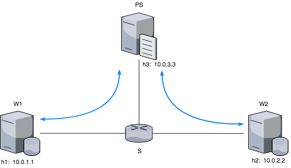
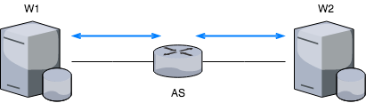

# Fast Byzantine ML Framework using In-Network Aggregation

This is the repository corresponding to a master thesis developed by Adrian Garcia Espinosa.
This master thesis was developed in at the **Universidad Politécnica de Madrid** and the **École Polytechnique Fédérale de Lausanne**
having as advisors; Arsany Guirguis, Prof. Rachid Guerraoui and Álvaro Carrera Barroso.

## Key Concepts

+ In-Network computing
+ Distributed Machine Learning
+ Byzantine Fault Tolerance

# Technologies

+ **Vagrant:** enables the configuration and management of Virtual Machines. Vagrant was used to manage a VM that contains the needed dependencies for deploying and testing the implementation [41].
+ **Mininet:** as it has been detailed on the background section (2), mininet was used to deploy the different setups with the corresponding topologies.
+ **P4:** also been detailed on the background section (2). P4 us a domain specific language, very limited and used for programming on programmable switches.
+ **Python:** it is an interpreted, high-level, general-purpose programming language. All the workers and parameter server logic has been developed with python. Not only the communication logic but also the ML modules.

# Scenarios

In order to be able to compare the performance and functioning of the system, two deployments will be tested trying to use in both the closest environment setup possible:

## Standard Parameter Server (PS)

## In-Network Parameters Server (AS)

